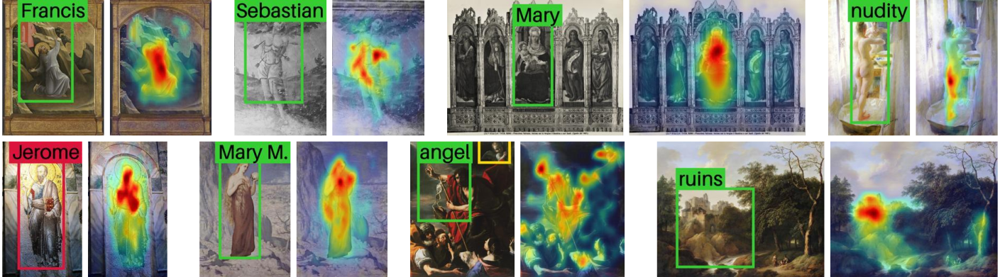

# Abstract

Object detection in art is a valuable tool for the digital humanities, as it allows for faster identification of objects in artistic and historical images compared to humans. However, annotating such images poses significant challenges due to the need for specialized domain expertise. We present NADA (<u>n</u> <u>a</u>nnotations for <u>d</u>etection in <u>a</u>rt), a pipeline that leverages diffusion models' art-related knowledge for object detection in paintings without the need for full bounding box supervision. Our method, which supports both weakly-supervised and zero-shot scenarios and does not require any fine-tuning of its pretrained components, consists of a class proposer based on large vision-language models and a class-conditioned detector based on Stable Diffusion. NADA is evaluated on two artwork datasets, ArtDL 2.0 and IconArt, outperforming prior work in weakly-supervised detection, while being the first work for zero-shot object detection in art. Code is available at [`https://github.com/patrick-john-ramos/nada`](https://github.com/patrick-john-ramos/nada)

# NADA


NADA consists of predicting classes from a painting with a class proposer and extracting bounding boxes for the predicted classes with a class-conditioned detector.

The class proposer can operate in a weakly-supervised or a zero-shot setting. The weakly supervised class proposer (WSCP) trains a lightweighted MLP to classify inputs, while the zero-shot class proposer (ZSCP) uses a VLM.

The class-conditioned detector leverages Stable Diffusion to extract bounding boxes by inverting and regenerating the painting conditioned on an input prompt. The cross-attention maps from the predicted class are aggregated and processed with watershed segmentation to find the bounding box

# Results



NADA can localize objects and recognize iconographic elements (ex. Saint Sebastian's arrows). However, limitations include misclassifications (ex. Paul → Jerome) or incorrect boxes (ex. angel).

## Weakly-supervised detection

| Method | Train detector? |  ArtDL 2.0 | IconArt |
| --- | :---: |  :---: | :---: |
| PCL | ✅ |  24.8 | 5.9 |
| CASD | ✅ |13.5 | 4.5 |
| UWSOD | ✅ |7.6 | 6.2 |
| CAM+PaS | ✅ |40.3 | 3.2 |
| Milani | ✅ |41.5 | **16.6** |
| MI-Max-HL | ❌ | 8.2 | 14.5 |
| NADA <sub>(with WSCP)</sub> | ❌ | **45.8** | 13.8 |

NADA <sub>(with WSCP)</sub> is competitive with other WSOD methods on art image datasets while being only one of two evaluated methods that does not require training the detector.

## Zero-shot supervised detection

| Class proposal | ArtDL 2.0 | IconArt |
| --- | :---: | :---: |
| CLIP | 13.3 | 6.8 |
| InstructBLIP | 18.6 | 7.9 |
| NADA <sub>(with ZSCP)</sub> | **21.8** | **15.1** |

As the first work into zero-shot object detection in artwork images, NADA <sub>(with ZSCP)</sub> is compared to two baseline class proposers, outperforming both.

# Citation

```
@InProceedings{Ramos_2025_WACV,
    author    = {Ramos, Patrick and Gonthier, Nicolas and Khan, Selina and Nakashima, Yuta and Garcia, Noa},
    title     = {No Annotations for Object Detection in Art through Stable Diffusion},
    booktitle = {Proceedings of the IEEE/CVF Winter Conference on Applications of Computer Vision (WACV)},
    month     = {February},
    year      = {2025}
}
```
