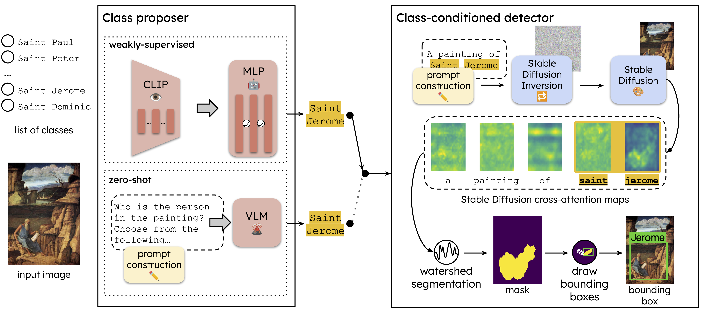

# Abstract

Object detection in art is a valuable tool for the digital humanities, as it allows for faster identification of objects in artistic and historical images compared to humans. However, annotating such images poses significant challenges due to the need for specialized domain expertise. We present NADA (<u>n</u> <u>a</u>nnotations for <u>d</u>etection in <u>a</u>rt), a pipeline that leverages diffusion models' art-related knowledge for object detection in paintings without the need for full bounding box supervision. Our method, which supports both weakly-supervised and zero-shot scenarios and does not require any fine-tuning of its pretrained components, consists of a class proposer based on large vision-language models and a class-conditioned detector based on Stable Diffusion. NADA is evaluated on two artwork datasets, ArtDL 2.0 and IconArt, outperforming prior work in weakly-supervised detection, while being the first work for zero-shot object detection in art. Code is available at [`https://github.com/patrick-john-ramos/nada`](https://github.com/patrick-john-ramos/nada)

# NADA



Official code for No Annotations for Object Detection in Art through Stable Diffusion (WACV 2025)

## Setup

This repository is composed of three folders corresponding to different parts of training or evaluting NADA. The code is organized this way to prevent conflicting dependicies.

* `prompt-to-prompt`

	This folder contains code for the class proposers not based on LLaVA and the class-conditioned detector. This uses code from [Google's prompt-to-prompt repository](https://github.com/google/prompt-to-prompt) and [DAAM](https://github.com/castorini/daam).

	Create a Python virtual environment and pip install the corresponding requirements file to set up the folder.

	* For the class-conditioned detector and weakly-supervised class proposer
		
		```bash
		cd prompt-to-prompt
		python -m venv env
		source env/bin/activate
		pip install -r requirements.txt
		```

	* For the non-LLaVA zero-shot class proposers

		```bash
		cd prompt-to-prompt
		python -m venv cp_env
		source cp_env/bin/activate
		pip install -r cp_requirements.txt
		```

* `detectron2`

	Code for evaluating predictions made by NADA. Bounding boxes are saved in the COCO format, so we use [Meta's Detectron2 library](https://github.com/facebookresearch/detectron2) to evaluate them.

	Create a virtual environment and pip install from `requirements.txt` to set it up.

	```bash
	cd detectron2
	python -m venv env
	source env/bin/activate
	pip install -r requirements.txt
	```

* `LLaVA`

	Code for generating outputs with LLaVA. We use LLaVA for our zero-shot class proposer and for caption prompt construction. This uses code from the [official LLaVA repository](https://github.com/haotian-liu/LLaVA/tree/main).

	Create a Python environment and install from folder to set it up.

	```bash
	cd LLaVA
	python -m venv env
	source env/bin/activate
	pip install -e .
	```

# Preparing data

Download [ArtDL](https://artdl.org/) and [IconArt](https://wsoda.telecom-paristech.fr/downloads/dataset/) and place the `ArtDL` and `IconArt_v1` folders in a `data` folder at the root of the repository.

## Using NADA

### Using the class proposer

#### Weakly-supervised class proposer

Run `prompt-to-prompt/classify/fc.py` to train and perform inference (to create labels for use with the class-conditioned detector) with the weakly-supervised class proposer.

```bash
cd prompt-to-prompt
python classify/fc.py \
--dataset {artdl, iconart} \
--classification-type {single, multi} \
--data-type images \
--modes {train, eval, label} \
--num-layers {2, 3} \
--checkpoint checkpoints/{artdl, iconart}/checkpoint.ckpt \
--save-dir labels/{ex. artdl_wscp}
```

Specify `--eval-label-split {}` when `eval` or `label` (inference) is includes in `--modes`. Refer to `prompt-to-prompt/data/classify_with_labels.py` for the splits per dataset. Items in `{}` are options/examples.

#### Zero-shot class proposer

Run `LLaVA/classify.py` to train the zero-shot class proposer.

```bash
cd LLaVA
python classify.py \
--dataset {artdl, iconart} \
--prompt {who, score}
--dataset-split {}
--save-dir ../prompt-to-prompt/labels/{ex. artdl_zscp}
```

Use `--prompt who` (the choice prompt in the paper) for `artdl` and `--prompt score` (the score prompt in the paper) for `iconart`.

### Using the class-conditioned detector

The class-conditioned detector uses the labels inferred by the class proposer to perform detection requires no training. The detector relies on a text prompt, and we support two kinds of prompt construction.

#### Template prompt construction

Template prompt construction inserts the labels into templates à la CLIP. Run `prompt-to-prompt/generate.py`:

```bash
cd prompt-to-prompt
python generate.py \
--dataset {artdl, iconart} \
--dataset-split {} \
--prompt-type {} \
--save-dir annotations/{ex. artdl_wscp} \
--label-dir labels/{ex. artdl_wscp}
```

In the paper, we use `--prompt-type wikipedia` for `artdl` and `--prompt-type custom_1` for `iconart`.

#### Caption prompt construction

Caption prompt construction uses a caption containing the label as a prompt. First, create captions using `LLaVA/caption.py`:

```bash
cd LLaVA
python caption.py \
--dataset {artdl, iconart \
--dataset-split {} \
--prompt-type \
--label-dir {ex. ../prompt-to-prompt/labels/artdl_wscp} \
--save-dir {ex. ../prompt-prompt/captions/artdl_wscp}
```

Then run `LLaVA/check_captions.py` to check if the captions contain the labels at indices within the maximum input length of the diffusion model, and modify them if necessary.

```bash
--dataset {artdl, iconart \
--dataset-split {} \
--prompt-type \
--save-dir {ex. ../prompt-prompt/captions/artdl_wscp}
```
Once the captions are ready, use `prompt-to-prompt/generate.py` like in **[template prompt construction](#template-prompt-construction)**, but instead of `--label-dir`, use `--caption-dir`.

## Evaluation

Use the `nada_eval.ipynb` notebook in `LLaVA`.

## Citation

```
@InProceedings{Ramos_2025_WACV,
    author    = {Ramos, Patrick and Gonthier, Nicolas and Khan, Selina and Nakashima, Yuta and Garcia, Noa},
    title     = {No Annotations for Object Detection in Art through Stable Diffusion},
    booktitle = {Proceedings of the IEEE/CVF Winter Conference on Applications of Computer Vision (WACV)},
    month     = {February},
    year      = {2025}
}
```
